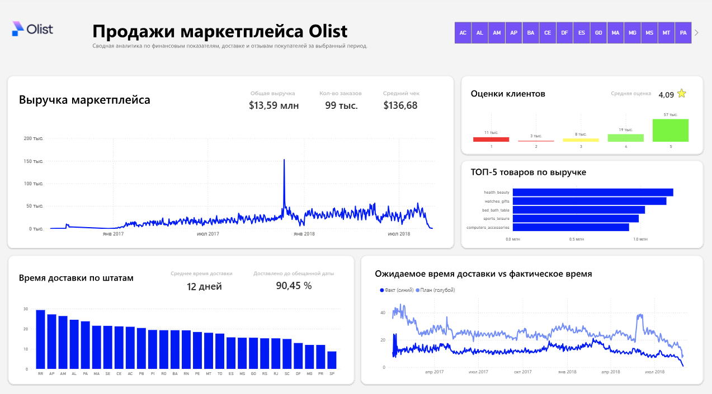

# Olist E-Commerce Analytics: Анализ продаж бразильского маркетплейса

## 📌 О проекте
Комплексный Pet-проект по анализу данных бразильского маркетплейса Olist (более 100 тыс. реальных заказов за 2016-2018 гг.).
**Цель проекта** — пройти полный путь аналитика данных: от развертывания базы данных и очистки "грязных" логов до создания интерактивного бизнес-дашборда для стейкхолдеров.

**Роль:** Data Analyst / BI Developer
**Стек:** SQL (PostgreSQL), Power BI, Figma, Excel.

## 💼 Бизнес-задачи
Перед проектом стояла задача ответить на ключевые вопросы бизнеса, которые ранее решались интуитивно:
1.  **Динамика продаж:** Растет ли выручка компании и как влияет сезонность?
2.  **Эффективность логистики:** Насколько часто реальная дата доставки (`Факт`) превышает обещанную (`План`)?
3.  **Качество сервиса:** Существует ли корреляция между скоростью доставки и оценками пользователей?

## 🚀 Архитектура решения
Работа была выстроена в виде ETL-пайплайна:

### 1. Data Engineering (SQL & PostgreSQL)
*   Развернута локальная база данных PostgreSQL.
*   Реализована загрузка 9 CSV-файлов с использованием серверной команды `COPY` для обхода проблем с кодировкой (UTF-8) и спецсимволами в текстовых отзывах.
*   Написаны SQL-скрипты для первичной агрегации данных.

### 2. Data Modeling (Power BI)
*   Построена модель данных **Star schema**.
*   Настроены связи "Один-ко-многим" с однонаправленной фильтрацией для исключения циклов и ошибок в расчетах.

### 3. Визуализация и UX (Figma + Power BI)
*   Разработан макет дашборда в **Figma** с упором на UX (сетка, цветовая палитра бренда).
*   Созданы сложные **DAX-меры**:
    *   `% On Time Rate` (Процент заказов, доставленных вовремя).
    *   Динамическое переключение метрик (Plan vs Fact).

## 📊 Ключевые инсайты
*   **Логистика:** Среднее время доставки составляет **12.5 дней**. При этом 90.45% заказов доставляются в обещанный срок.

## 📂 Структура репозитория
*   `sql/` — DDL скрипты создания таблиц, ETL-запросы.
*   `dashboard/` — Исходный файл Power BI (.pbix).
*   `assets/` — Скриншоты дашборда, логотип и макеты из Figma.
*   `docs/` — Презентация проекта (PDF) и словарь данных.

## 🔗 Источник данных
[Brazilian E-Commerce Public Dataset by Olist](https://www.kaggle.com/datasets/olistbr/brazilian-ecommerce)

---
*Автор: Анатолий Коношонок*
*https://www.linkedin.com/in/anatolykonoshonok/*